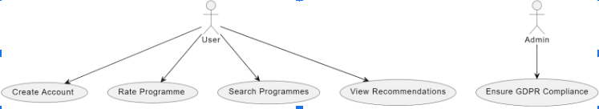
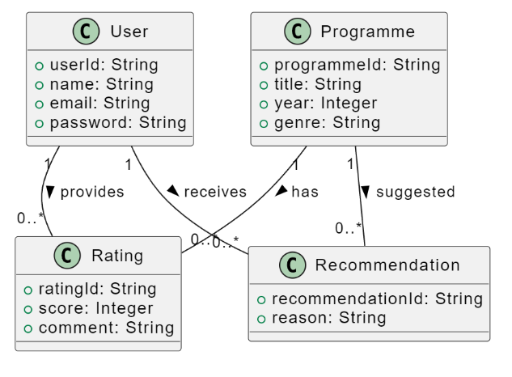
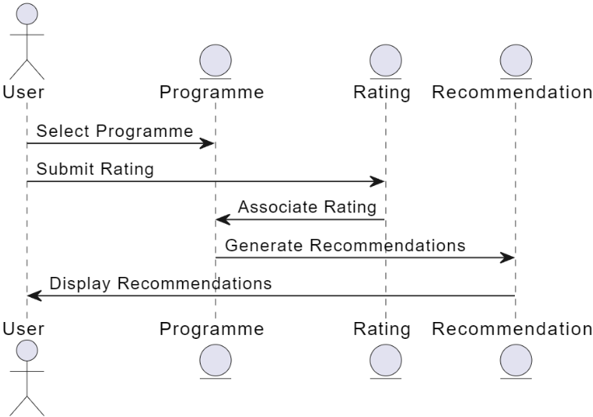

# SP3 - Store Systemer

## Systematic Approach to Technology Stack and Architecture Selection

When selecting the technology stack and architecture, we compared Layered Architecture against Microservices Architecture using the following criteria:

- **Complexity**: Layered Architecture is simpler to implement, making it the better choice for a smaller team familiar with ASP.NET Core.
- **Scalability**: Although microservices provide better scalability, the Layered Architecture’s horizontal scaling is sufficient for the current project scope.
- **Maintainability**: Layered Architecture offers a clear separation of concerns, making it easier to manage, especially for teams working with established frameworks.
- **Performance**: Layered Architecture paired with Dapper offers fast, direct SQL query execution, avoiding the overhead found in microservice intercommunication.

Based on these factors, we chose Layered Architecture, prioritizing simplicity and team familiarity without sacrificing the project’s ability to scale in the future.

## Technology Stack

For the MyDRTV project, we chose a technology stack that balances simplicity, scalability, and familiarity with tools we are experienced with.

### Frontend
We selected Razor Views (CSHTML) for the frontend as we are both experienced with it, and also due to its seamless integration with ASP.NET Core and ability to dynamically generate HTML using C#. This enables smooth interaction between the front and backend, making the development process efficient. Bootstrap was added to ensure a responsive and visually appealing design without needing extensive custom CSS.

### Backend
For the backend, we chose ASP.NET Core (C#), a versatile and high-performance framework that integrates well with Visual Studio, which we are very familiar with. It supports the scalability required for the project. For data access, we went for Dapper, which provides a simple and efficient way to interact with the database using SQL while maintaining control over queries.

### Database
We selected Microsoft SQL Server for its robust handling of structured data and easy management via SQL Server Management Studio (SSMS). This choice ensures we can efficiently manage user data, program metadata, and ratings.

### Media Storage
For simplicity, we chose local file storage to manage video content. Although we considered cloud solutions, local storage is sufficient for the scope of this project.

### Authentication and Security
We use ASP.NET Identity to handle authentication, ensuring secure login and user data management. SSL/TLS encryption is used to secure communication, and ASP.NET’s built-in password hashing ensures compliance with security and GDPR regulations.

### Deployment
We plan to deploy the application using Azure App Service, which provides an easy-to-use and scalable platform. Integration with GitHub allows for continuous deployment, simplifying updates and version control.

## Choice of Architecture

For the MyDRTV project, we have chosen the Layered Architecture pattern as it aligns well with our technology stack of ASP.NET Core, C#, Razor Views (CSHTML), and Microsoft SQL Server. This architecture divides the application into distinct layers, ensuring clear separation of concerns.

### Why Layered Architecture?

The Layered Architecture pattern organizes the system into:
- **Presentation Layer**: Handles the user interface with Razor Views and Bootstrap.
- **Business Logic Layer**: Manages the core functionality, such as user interactions and program recommendations.
- **Data Access Layer**: Interacts with the database using Dapper and Microsoft SQL Server.

### Benefits
- **Separation of Concerns**: Each layer handles a specific part of the application, improving maintainability and making changes easier to manage.
- **Simplicity**: This architecture is straightforward, reducing complexity for our team, which is familiar with ASP.NET Core and Visual Studio.
- **Ease of Testing**: Each layer can be tested independently, ensuring that core functionalities can be validated in isolation.
- **Scalability**: While not as scalable as microservices, the architecture allows for horizontal scaling, which is sufficient for the scope of this project.

By adopting this approach, we ensure the development process remains efficient and manageable, with each layer focusing on a distinct responsibility.

## Use Case Diagram

Our Use Case Diagram represents the main interactions users will have with the system:
- **Account Management**: Users can register, log in, and manage their profiles.
- **Search and Watch Programs**: Users can search for TV programs by title, genre, or year and watch content.
- **Rate Programs**: Users will be able to rate programs and interact with a recommendation system based on their preferences.

This diagram provides an overview of the core functionalities we’re focusing on in this project.

## Domain Model

Our Domain Model outlines the key entities and their relationships:
- **User**: Represents users with details like login credentials, ratings, and profile information.
- **Program**: Contains information on TV programs such as title, genre, year of production, and ratings.
- **Rating**: Captures the relationship between users and programs, representing user feedback in the form of ratings.

This model forms the backbone of our system’s data structure and supports key business logic like recommendations and user interactions.

## Sequence Diagram

The Sequence Diagram details the interaction flow between the frontend (Razor Views), business logic layer, and data access layer:
1. The user initiates a request (e.g., searching for a program).
2. The request flows through the business logic layer, where relevant actions such as querying recommendations or program metadata occur.
3. The data access layer retrieves the necessary data from SQL Server using Dapper, and the result is sent back through the layers to the user interface.
